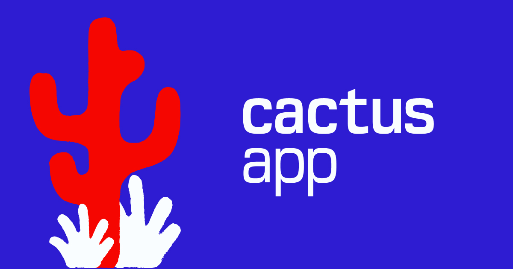

<p align="center">
  
</p>

<h1 align="center">Cactus Money</h1>

<p align="center">
  A local-first personal finance app. Track spending, plan budgets, stay sharp.
</p>

<p align="center">
  
  
  
  
</p>

---

## What is this?

Cactus Money is a YNAB-inspired budgeting app that runs entirely in your browser. No accounts, no servers, no subscriptions — your financial data stays on your device in a SQLite database powered by WebAssembly.

### Key features

- **Cashflow tracking** — Income and expense tables with inline add/edit, recurring transactions, and status tracking (planned vs confirmed)
- **Multi-month overview** — Charts and pivot grids to see spending trends across months
- **PDF statement import** — Drop a bank statement PDF and let Claude AI extract transactions automatically, with duplicate detection
- **Categories** — Hierarchical categories with colors, inline editing, and full customization
- **Recurring transactions** — Weekly, monthly, quarterly, and yearly recurrence
- **CSV export** — Configurable column selection, date range filtering, and saved preferences
- **Auto-export** — Optionally sync backups to a local directory (iCloud, Dropbox, etc.) via the File System Access API
- **PWA** — Installable as a native-feeling app on desktop and mobile
- **Dark mode** — Light, dark, or system-matched theme

## Tech stack

| Layer | Tech |
|-------|------|
| Runtime | [Bun](https://bun.sh) |
| Framework | React 19 + [TanStack Router](https://tanstack.com/router) (file-based SPA) |
| Build | [Vite 7](https://vite.dev) |
| Styling | [Tailwind CSS v4](https://tailwindcss.com) |
| Database | [wa-sqlite](https://github.com/nicolo-ribaudo/nicolo-nicolo-ribaudo.github.io) (WASM) via Web Worker — OPFS primary, IndexedDB fallback |
| Charts | [Recharts](https://recharts.org) |
| AI | [Anthropic Claude](https://anthropic.com) (PDF import) |
| PWA | vite-plugin-pwa + Workbox |
| Validation | [Zod](https://zod.dev) |
| Hosting | [Cloudflare Pages](https://pages.cloudflare.com) |

## Architecture

```
Browser
├── React UI (SPA with file-based routing)
├── Custom hooks (useTransactions, useCashflow, useCategories, ...)
├── Event bus (pub/sub for cross-hook cache invalidation)
└── Web Worker
    └── wa-sqlite (WASM)
        └── OPFS / IndexedDB
```

The database is the single source of truth — no external state library. Mutations go through typed query modules, then emit events so subscribed hooks auto-refresh.

## Getting started

```bash
# Install dependencies
bun install

# Start dev server
bun run dev

# Production build
bun run build

# Preview production build
bun run preview

# Deploy to Cloudflare Pages
bun run deploy
```

## PDF import setup

To use the AI-powered bank statement import:

1. Get an API key from [Anthropic](https://console.anthropic.com)
2. Go to **Settings → AI Integration** in the app
3. Paste your API key (stored locally, never leaves your device except to call the Anthropic API)

## License

[MIT](LICENSE)
